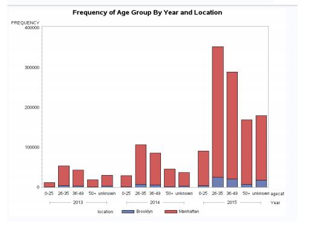

# Portfolio

    
### Titanic Survivor Dashboard
A tableau dashboard that displays the survival rates of Titanic passengers.

 
---

### Sales Data Dashboard
A simple tableau dashboard set up to explore sales data over time.

---  

### Citi Bikes Analysis in SAS
A school project in which I imported, cleaned, merged, and analyzed Citi Bike Data. The document includes SAS script and output as well as a discussion of methods and results. The image link opens a PDF.

---

### Get in Touch

- Email: leetevan72@gmail.com

---

